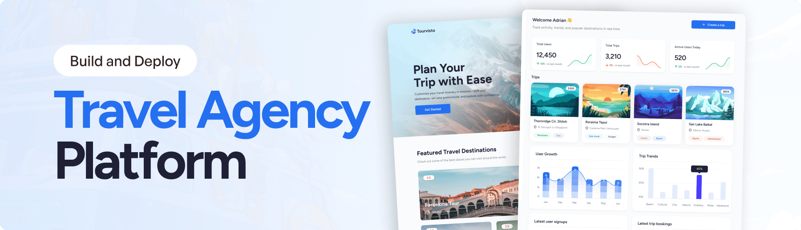
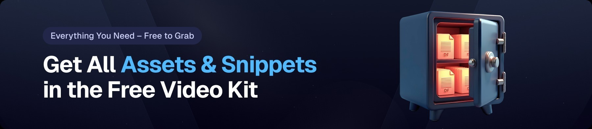
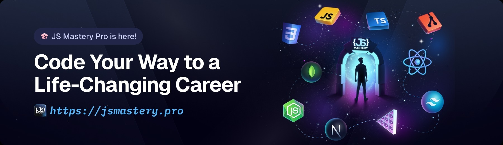

<div align="center">
  <br />
    <a href="https://www.youtube.com/watch?v=xZ1ba-RLrjo" target="_blank">
      
    </a>
  <br />
  <div>
    
    
    
    
  </div>
  <h3 align="center">Travel Agency Platform</h3>

  <div align="center">
     Build this project step by step with our detailed tutorial on <a href="https://www.youtube.com/@javascriptmastery/videos" target="_blank"><b>JavaScript Mastery</b></a> YouTube. Join the JSM family!
    </div>
</div>

## 📋 <a name="table">Table of Contents</a>

1. 🤖 [Introduction](#introduction)
2. ⚙️ [Tech Stack](#tech-stack)
3. 🔋 [Features](#features)
4. 🤸 [Quick Start](#quick-start)
5. 🔗 [Assets](#links)
6. 🚀 [More](#more)

## ⚠️ Tutorial

This repository contains the code corresponding to an in-depth tutorial available on our YouTube channel, <a href="https://www.youtube.com/@javascriptmastery/videos" target="_blank"><b>JavaScript Mastery</b></a>.

If you prefer visual learning, this is the perfect resource for you. Follow our tutorial to learn how to build projects like these step-by-step in a beginner-friendly manner!

<a href="https://www.youtube.com/watch?v=xZ1ba-RLrjo" target="_blank"></a>

## <a name="introduction">🤖 Introduction</a>

A modern travel agency platform with an admin dashboard and public site. Generate AI-powered trip itineraries based on country, travel style, interests, group type, and budget — and book trips with ease.

If you're getting started and need assistance or face any bugs, join our active Discord community with over **50k+** members. It's a place where people help each other out.

<a href="https://discord.com/invite/n6EdbFJ" target="_blank"></a>

## <a name="tech-stack">⚙️ Tech Stack</a>

- Syncfusion
- React Router v7 (framework mode)
- Appwrite
- Tailwind CSS
- Vite
- React 19

## <a name="features">🔋 Features</a>

### Features of the Travel Agency Project

👉 AI-powered trip itinerary generator

👉 Trip booking functionality on the public website

👉 Admin dashboard with trip and user management

👉 User growth metrics and trip analytics

👉 Interactive charts and trip statistics table

👉 Detailed trip overview

👉 Responsive UI with a modern design

👉 Secure user authentication and data management

👉 Modular code architecture with reusable components

and many more, built for scalability and a smooth user experience.

## <a name="quick-start">🤸 Quick Start</a>

Follow these steps to set up the project locally on your machine.

**Prerequisites**

Make sure you have the following installed on your machine:

- [Git](https://git-scm.com/)
- [Node.js](https://nodejs.org/en)
- [npm](https://www.npmjs.com/) (Node Package Manager)

**Cloning the Repository**

```bash
git clone https://github.com/adrianhajdin/travel-agency-dashboard.git
cd travel-agency-dashboard
```

**Installation**

Install the project dependencies using npm:

```bash
npm install
```

**Set Up Environment Variables**

Create a new file named `.env` in the root of your project and add the following content:

```env
VITE_SYNCFUSION_LICENSE_KEY=
VITE_APPWRITE_PROJECT_ID=
VITE_APPWRITE_API_ENDPOINT=
VITE_APPWRITE_API_KEY=
VITE_APPWRITE_DATABASE_ID=
VITE_APPWRITE_USERS_COLLECTION_ID=
VITE_APPWRITE_ITINERARY_COLLECTION_ID=
STRIPE_SECRET_KEY=
GEMINI_API_KEY=
UNSPLASH_ACCESS_KEY="
VITE_BASE_URL="http://localhost:5173"
```

### Replace the placeholder values with your actual credentials.

- **[Syncfusion](https://jsm.dev/tourvisto-syncfusion)**

- **[Appwrite](https://jsm.dev/tourvisto-appwrite)**

- **[Gemini AI](https://aistudio.google.com/)**

- **[Sentry](https://jsm.dev/tourvisto-sentry)**

- **[Stripe](https://stripe.com/)**

- **[Unsplash](https://unsplash.com/)**

**Running the Project**

```bash
npm run dev
```

Open [http://localhost:5173](http://localhost:5173/) in your browser to view the project.

## <a name="links">🔗 Assets</a>

- Assets used in the project can be found [here](https://jsm.dev/tourvisto-kit).
  <a href="https://jsm.dev/tourvisto-kit" target="_blank">
  
  </a>

## <a name="more">🚀 More</a>

**Advance your skills with Next.js Pro Course**

Enjoyed creating this project? Dive deeper into our PRO courses for a richer learning adventure. They're packed with
detailed explanations, cool features, and exercises to boost your skills. Give it a go!

<a href="https://jsm.dev/tourvisto-readme" target="_blank">
  
</a>
